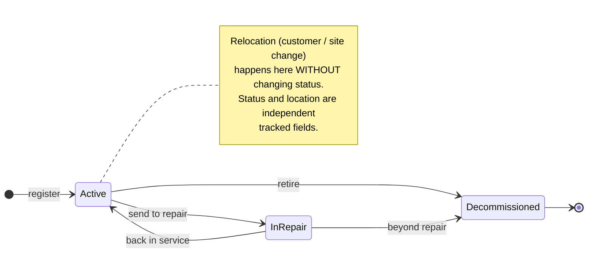
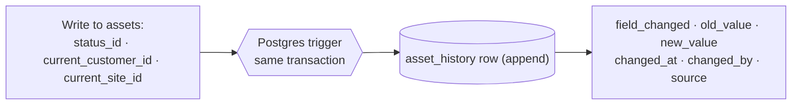

# Asset Lifecycle & History

Canonical logic for how an asset moves through its status lifecycle **and** how every tracked
change is historized. Two intertwined things share one mechanism: a small **status state
machine**, and a **generic history log** (`asset_history`) that captures *any* change to a
tracked field — status or location — so every past state stays queryable, never overwritten
(PRD §5.1).

## Part A — Status lifecycle

- **Registration can be minimal or full.** A technician can field-register a minimal asset
  on-site (label · customer · site); admin completes the profile later (PRD §5.1).
  **Profile completeness is orthogonal to status** — a minimally-registered asset is still
  `active`, just incomplete. Completeness is not a status value.
- `asset_statuses` is a **lookup table**, not an enum — adding a status is a data insert.
- **Decommissioned is not deletion.** The row stays queryable; the asset is retired, not
  removed. (Recommissioning, if ever needed, is an admin action back to `active` — kept out
  of the diagram until there's a real need.)

## Part B — History mechanism (every tracked change)

The same mechanism covers status changes, location/assignment changes, and any future tracked
field — one generic log, not a bespoke table per field (`technical-design.md` §2).

### `asset_history` columns

| Column | Meaning |
|---|---|
| `field_changed` | which field: `status_id` \| `current_site_id` \| `current_customer_id` \| (any future tracked field) |
| `old_value`, `new_value` | stored as **text**, cast on read — keeps the table generic across field types |
| `changed_at` | **system-set**, not user-editable |
| `changed_by` | user id (nullable if system-triggered) |
| `source` | `admin_edit` \| `job_completion` \| `csv_import` (extensible) |

## The invariant that makes this defensible

> **No write to `assets.current_customer_id` / `assets.current_site_id` / `assets.status_id`
> happens without an `asset_history` row in the same transaction — enforced by a Postgres
> trigger, not application-code discipline.**

A trigger can't be forgotten by a future code change; app-code discipline can. This is the
`schema-reviewer` rule (§2), and it's what lets REI answer "where was this unit, and what
state was it in, on any past date" — the location/status audit trail behind the enterprise
data-asset goal.

## Where it connects

- **Job completion** is a `source`: resolving a job that changes an asset's status (e.g. into
  `in_repair`) writes through this same mechanism, tagged `job_completion` — the FSM's resolve
  step and this log are the same transaction, not two records to reconcile.
- **Bulk import** is a `source` (`csv_import`) — historical migration writes history rows too,
  so imported assets aren't a blind spot in the trail (see the bulk-import staging flow).
- **Contract links** (`asset_contracts`, many-to-many) are the join table, separate from this
  status/location log; not tracked here.
