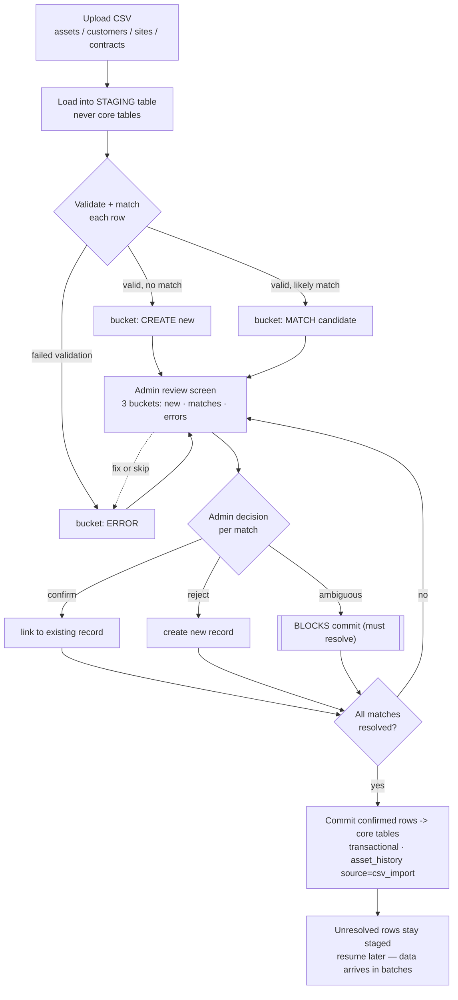

# Bulk Import — Staging Flow

Canonical logic for historical data migration (assets, customers, sites, contracts). This flow
exists to prevent one specific, documented prior-build bug: **CSV import auto-created duplicate
sites on a fuzzy match that should have linked to an existing record** (plus stray
auto-created "site 99/100" artifacts). The design principle is **staging, not direct insert**
(`technical-design.md` §5).

## The guardrails (why this shape)

- **Staging first, always.** Nothing is written to `customers` / `sites` / `assets` /
  `contracts` during import — everything lands in a staging table and is only promoted on
  explicit commit.
- **No auto-create on a fuzzy match.** A likely match (same customer name, same site address)
  is a *candidate* the admin must confirm or reject. An **ambiguous match blocks commit** — it
  never silently resolves one way or the other. This is the direct fix for the duplicate-site
  bug.
- **Three buckets, surfaced before commit:** new records to be created, likely matches for
  confirm/reject, and rows that failed validation. The admin sees all three, not a black-box
  "imported N rows."
- **Resumable / partial.** REI's data arrives in batches as it's cleaned up, not one clean
  file. Unresolved rows stay staged; import resumes later without re-uploading.
- **History on import.** Promoting rows writes through the normal path, so asset changes emit
  `asset_history` rows tagged `source = csv_import` (see the asset-lifecycle flow) — migrated
  assets are not a blind spot in the audit trail.

## The anti-pattern this blocks (call it out in QA)

> Prior build: a fuzzy match silently auto-created a duplicate site instead of linking, and
> produced stray auto-created "site 99/100" test artifacts from unclear matching behavior.

`qa-workflow-tester` §5 checks exactly this: bulk import must **not** silently auto-create a
duplicate on an ambiguous match — it must show the staged preview and require confirmation.
