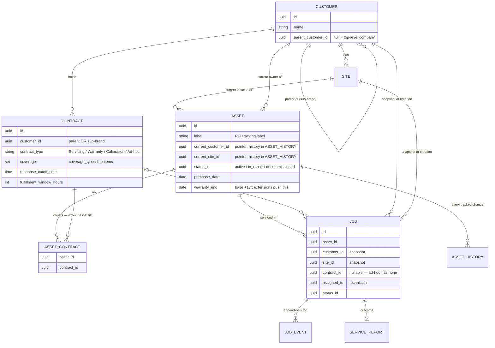

# Data Model — Entity Relationships

Canonical picture of how the core entities relate, matching `technical-design.md §2`.
This is the reference the schema and every screen's data are built against.

## The relationships that matter (and why)

- **Customer → Customer (self-reference).** `parent_customer_id` models a parent company and its
  sub-brands (FROST → Häagen-Dazs / Laughing Cow / Chobani). Only FROST needs it today; a normal
  customer has `parent_customer_id = null`.
- **Contract → Customer (parent OR sub-brand).** A contract is signed by whichever level holds it.
- **Contract ↔ Asset is the coverage.** `ASSET_CONTRACT` is the explicit list of assets a contract
  applies to — coverage is per-asset, not "all of a customer's assets". A job may only cite a
  `contract_id` its asset is linked to here.
- **Warranty lives in two places by design.** The asset carries the current effective base warranty
  (`purchase_date` + `warranty_end`). A purchased **extension** is a `Warranty`-type CONTRACT whose
  term pushes that date — so extensions get contract dates, coverage, and history for free.
- **Job FKs are snapshots.** `customer_id` / `site_id` / `contract_id` are copied onto the job at
  creation, so the record stays correct even after the asset later relocates. The move itself is
  preserved in `ASSET_HISTORY`; cross-customer moves are allowed but rare.
