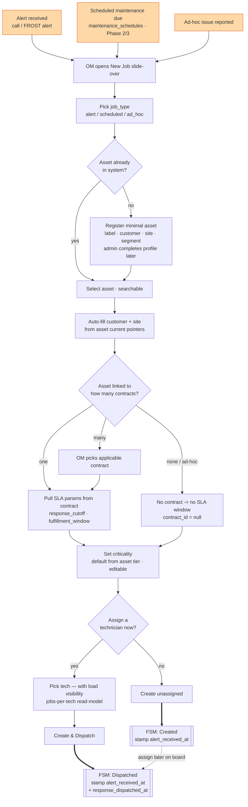

# Dispatch / Create-Job Flow

Canonical logic for how a job is born and dispatched — the ops_manager (Mervyn) path that
replaces WhatsApp. This is the front door to the state machine: it ends by handing a job to
[`job-lifecycle-fsm.md`](./job-lifecycle-fsm.md) at either **Created** or **Dispatched**.

Speed is a hard requirement here (PRD §5.4): this path must be at least as fast as WhatsApp,
or it gets bypassed under time pressure — which is exactly when the SLA timestamp matters most.

## The rules that make this data defensible

- **`alert_received_at` is stamped at creation, live** — not backfilled at end of day. This is
  the start of the SLA clock and the single most important timestamp for the enterprise-pitch
  dataset. It is system-set, never a form field (`schema-reviewer` rule).
- **`response_dispatched_at` is stamped when the tech is assigned + dispatched** (the "yes"
  branch). The second half of the [dual response clock](./job-lifecycle-fsm.md) —
  `response_acknowledged_at` — is stamped later by the technician, not here.
- **Creation writes a `job_events: created` row** (append-only).
- **Job types stay generic.** `alert` / `scheduled` / `ad_hoc` are lookup rows; contract
  parameters (not the job type, and never a named-customer conditional) determine SLA behavior
  — enforced by `scope-guard`.

## Decision points worth calling out

- **Asset not found → minimal register.** Reuses the field-discovery capability (PRD §5.1): a
  job should never be blocked because an asset profile is incomplete. Admin completes it later.
  (On the OM path this is the exception; the primary path is "asset exists.")
- **Asset ↔ contract is many-to-many.** If an asset sits on more than one contract, the OM
  must pick which one governs *this* job's SLA — the flow cannot silently guess.
- **Ad-hoc / no contract** is legal: `contract_id = null`, no SLA window. The job still tracks
  timestamps; it just isn't SLA-bound.
- **Assign-now vs create-unassigned** is the fork between entering the FSM at **Dispatched**
  vs **Created**. An unassigned job waits on the dispatch board and is assigned later — the
  same `Created → Dispatched` edge, just deferred.
- **Technician load visibility** at the assign step is the parked "measured bandwidth" item
  (`design-review.md` §3) — a jobs-per-tech read-model so assignment is informed, not blind.
  Not a scheduler; just visibility. Cheap, high-value, still to be confirmed for MVP.

## Future entry point (Phase 4, not now)

The whole sequence above is one structured `create_job` server action. The AI-readiness thesis
(`design-review.md` §5) adds a *second input* to that same action later: **conversational
dispatch** — Mervyn types/voices "chiller down at FairPrice Bugis, send Rajesh" and the LLM
fills the same validated fields, guarded by the same rules. Same destination, WhatsApp-speed
input. Fenced to Phase 4; noted here so the create action is designed to accept it without a
rewrite.
