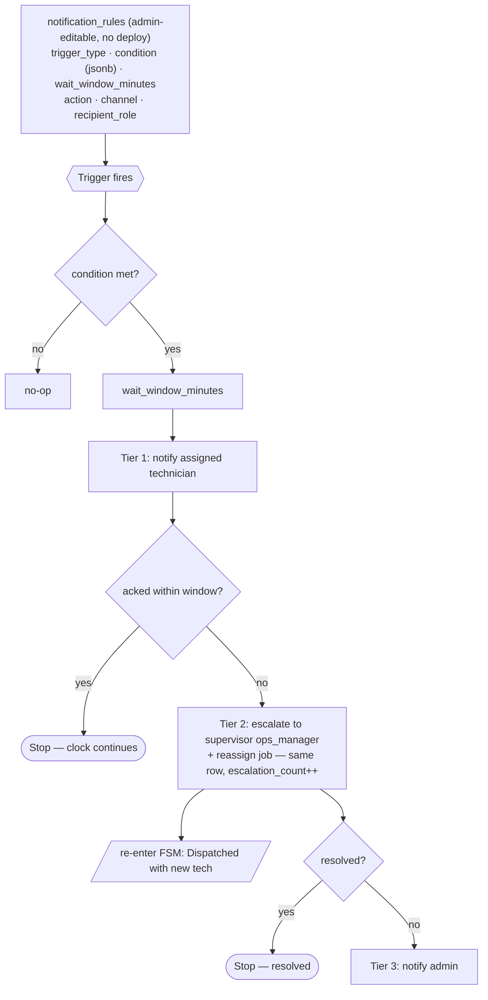

# Escalation & Notification Flow

Canonical logic for the `notification_rules` structure — the **one sanctioned rules-engine
exception** (`technical-design.md` §2, guarded by `scope-guard`). Everything else stays fixed
schema; this domain alone is data-configurable (`trigger → condition → wait window →
action/channel`).

## Triggers

| trigger_type | Fires when | Typical action |
|---|---|---|
| `sla_pre_breach` | **Before** the SLA deadline (heads-up) | notify — **no reassign** |
| `job_overdue` | **After** the SLA deadline passes | escalate (tiered) |
| `dispatched_not_ack` | Dispatched but not moved to Accepted within the window | escalate to supervisor |
| `contract_expiring` | Contract `renewal_date` approaching | notify admin |

Pre-breach vs post-breach is a real distinction: `sla_pre_breach` is a warning that lets the
team act *before* the number is blown; `job_overdue` is the escalation ladder after it is.

## The `notification_rules` shape (recap)

- `trigger_type` — one of the above
- `condition` (jsonb) — e.g. `{"criticality_tier": "high", "threshold_minutes": 120}`
- `wait_window_minutes` — how long to wait for acknowledgement before the next tier
- `action` — `notify` | `escalate`
- `channel` — `in_app` | `email` | `whatsapp`
- `recipient_role` — a **role**, never a named person (survives staff changes)

## How it ties back to the FSM

Tier 2's reassignment is the **`Escalated → Dispatched`** edge in
[`job-lifecycle-fsm.md`](./job-lifecycle-fsm.md): same `jobs` row, `assigned_to` changes,
`escalation_count++`. The ladder does not create new jobs and does not live outside the state
machine — it drives the machine.

## Delivery note (build reminder)

`channel = whatsapp` means the **WhatsApp Business API** — real cost + approval lead time, and
the one place WhatsApp legitimately survives (as an *output* channel, never the system of
record). Notification *delivery* should go through a provider, not a hand-maintained
integration (`design-review.md` §4).
