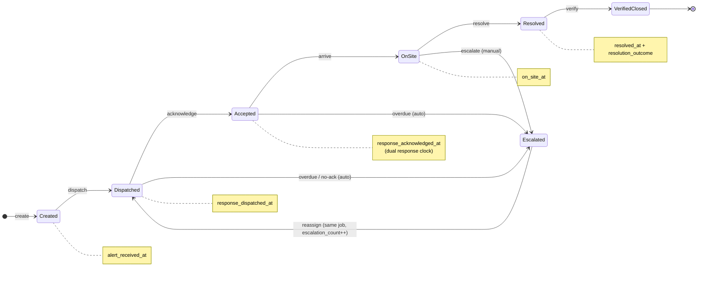

# Job Lifecycle — Finite State Machine

Canonical logic for the `jobs` state machine. This is the spec the **shared transition
rulebook** (`design-review.md` §2.4) is implemented from — the list of legal
`job_status → job_status` moves, read by both client and server.

Reflects the recorded decisions: **dual response clock**, **Accepted/En-route substate**,
and **`resolution_outcome`** on resolve.

## Transition table (the buildable spec)

| From | Event | To | Actor | Timestamp captured (system-set) | Side effects |
|---|---|---|---|---|---|
| — | create | Created | ops_manager | `alert_received_at` | new `jobs` row; `job_events: created` |
| Created | dispatch | Dispatched | ops_manager | `response_dispatched_at` | set `assigned_to`; `job_events: status_change` |
| Dispatched | acknowledge | Accepted | technician | `response_acknowledged_at` | `job_events: status_change` |
| Accepted | arrive | On-site | technician | `on_site_at` | `job_events: status_change` |
| On-site | resolve | Resolved | technician | `resolved_at` | write `resolution_outcome`; `service_report`; `job_events: status_change` |
| Resolved | verify | Verified/Closed | admin | — | `job_events: status_change` |
| Dispatched / Accepted | overdue / no-ack | Escalated | system (auto) | `escalated_at` | `escalation_count++`; see escalation flow |
| On-site | escalate | Escalated | technician | `escalated_at` | `escalation_count++` |
| Escalated | reassign | Dispatched | ops_manager / system | (new `response_dispatched_at` on re-dispatch) | reassign `assigned_to` on **same row**; never a new job |

## Rules that must hold (guards)

- **No skipping.** The only legal moves are the rows above; e.g. Created → Resolved is illegal.
- **Escalation is reassignment, never a new job.** `Escalated → Dispatched` updates
  `assigned_to` + increments `escalation_count` on the same `jobs` row.
- **Timestamps are system-set at the event**, never free-text/editable (enforced per
  `schema-reviewer`).
- **Every transition inserts a `job_events` row** (append-only; no UPDATE).
- **`resolution_outcome`** is required on the resolve transition. Values:
  `fixed` · `temporary_fix` · `no_access` · `revisit_required`.
  `revisit_required` is the seam a future revisit-scheduling feature hangs off.

## The two response timestamps

`response_dispatched_at` (ops_manager assigns) and `response_acknowledged_at` (technician
accepts / en-route) are both captured. Reporting decides which one "response time" means per
contract; both are available. The gap between them is also what the escalation
`dispatched_not_ack` trigger fires on.
